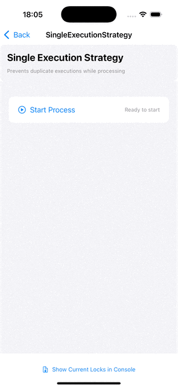
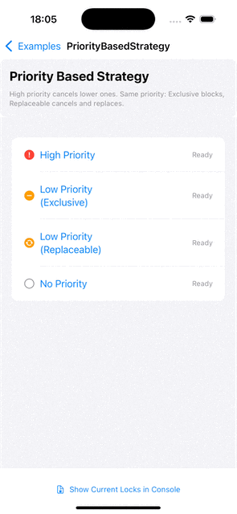

[](https://github.com/takeshishimada/Lockman/actions?query=workflow%3ACI)
[](https://swift.org/download/)
[](https://developer.apple.com/)

[English](../README.md) | [日本語](README_ja.md) | [简体中文](README_zh-CN.md) | [繁體中文](README_zh-TW.md) | [Español](README_es.md) | [Français](README_fr.md) | [Deutsch](README_de.md) | [한국어](README_ko.md) | [Português](README_pt-BR.md) | [Italiano](README_it.md)

Lockman ist eine Swift-Bibliothek, die Probleme bei der Kontrolle konkurrierender Aktionen in The Composable Architecture (TCA) Anwendungen löst, mit Fokus auf Reaktionsfähigkeit, Transparenz und deklaratives Design.

* [Design-Philosophie](#design-philosophie)
* [Überblick](#überblick)
* [Grundlegendes Beispiel](#grundlegendes-beispiel)
* [Installation](#installation)
* [Community](#community)

## Design-Philosophie

### Designing Fluid Interfaces Prinzipien

Die Präsentation "Designing Fluid Interfaces" der WWDC18 stellte Prinzipien für außergewöhnliche Schnittstellen vor:

* **Sofortige Reaktion und kontinuierliche Umleitung** - Reaktionsfähigkeit, die nicht einmal 10ms Verzögerung toleriert
* **Eins-zu-Eins-Bewegung zwischen Berührung und Inhalt** - Inhalt folgt dem Finger während Ziehvorgängen
* **Kontinuierliches Feedback** - Sofortige Reaktion auf alle Interaktionen
* **Parallele Gestenerkennung** - Gleichzeitige Erkennung mehrerer Gesten
* **Räumliche Konsistenz** - Beibehaltung der Positionskonsistenz während Animationen
* **Leichte Interaktionen, verstärkte Ausgabe** - Große Effekte aus kleinen Eingaben

### Traditionelle Herausforderungen

Die traditionelle UI-Entwicklung löste Probleme, indem sie gleichzeitige Tasteneingaben und doppelte Ausführungen einfach verbot. Diese Ansätze wurden zu Faktoren, die die Benutzererfahrung im modernen flüssigen Interface-Design behindern.

Benutzer erwarten eine Form von Feedback, auch wenn sie gleichzeitig Tasten drücken. Es ist entscheidend, die sofortige Reaktion auf UI-Ebene klar von der angemessenen gegenseitigen Ausschlusskontrolle auf Geschäftslogikebene zu trennen.

## Überblick

Lockman bietet die folgenden Kontrollstrategien zur Lösung häufiger Probleme in der Anwendungsentwicklung:

* **Single Execution**: Verhindert doppelte Ausführung derselben Aktion
* **Priority Based**: Prioritätsbasierte Aktionskontrolle und -stornierung
* **Group Coordination**: Gruppenkontrolle über Leader/Member-Rollen
* **Dynamic Condition**: Dynamische Kontrolle basierend auf Ausführungsbedingungen
* **Concurrency Limited**: Begrenzt die Anzahl gleichzeitiger Ausführungen pro Gruppe
* **Composite Strategy**: Kombination mehrerer Strategien

## Beispiele

| Single Execution Strategy | Priority Based Strategy | Concurrency Limited Strategy |
|--------------------------|------------------------|------------------------------|
|  |  |  |

## Code-Beispiel

So implementieren Sie eine Funktion, die doppelte Prozessausführung mit dem `@LockmanSingleExecution` Makro verhindert:

```swift
import CasePaths
import ComposableArchitecture
import Lockman

@Reducer
struct ProcessFeature {
    @ObservableState
    struct State: Equatable {
        var isProcessing = false
        var message = ""
    }
    
    @CasePathable
    enum Action: ViewAction {
        case view(ViewAction)
        case `internal`(InternalAction)
        
        @LockmanSingleExecution
        enum ViewAction {
            case startProcessButtonTapped
            
            var lockmanInfo: LockmanSingleExecutionInfo {
                .init(actionId: actionName, mode: .boundary)
            }
        }
        
        enum InternalAction {
            case processStart
            case processCompleted
            case updateMessage(String)
        }
    }
    
    enum CancelID {
        case userAction
    }
    
    var body: some Reducer<State, Action> {
        Reduce { state, action in
            switch action {
            case let .view(viewAction):
                switch viewAction {
                case .startProcessButtonTapped:
                    return .run { send in
                        await send(.internal(.processStart))
                        // Schwere Verarbeitung simulieren
                        try await Task.sleep(nanoseconds: 3_000_000_000)
                        await send(.internal(.processCompleted))
                    }
                }
                
            case let .internal(internalAction):
                switch internalAction {
                case .processStart:
                    state.isProcessing = true
                    state.message = "Verarbeitung gestartet..."
                    return .none
                    
                case .processCompleted:
                    state.isProcessing = false
                    state.message = "Verarbeitung abgeschlossen"
                    return .none
                    
                case .updateMessage(let message):
                    state.message = message
                    return .none
                }
            }
        }
        .lock(
            boundaryId: CancelID.userAction,
            lockFailure: { error, send in
                // Wenn die Verarbeitung bereits läuft
                if error is LockmanSingleExecutionError {
                    // Nachricht über eine Aktion aktualisieren anstatt direkte Zustandsmutation
                    await send(.internal(.updateMessage("Verarbeitung läuft bereits")))
                }
            },
            for: \.view
        )
    }
}
```

Der `Reducer.lock` Modifikator wendet automatisch Lock-Management auf Aktionen an, die dem `LockmanAction` Protokoll entsprechen. Da die `ViewAction` Enumeration mit `@LockmanSingleExecution` markiert ist, wird die `startProcessButtonTapped` Aktion nicht erneut ausgeführt, während die Verarbeitung läuft. Der Parameter `for: \.view` weist Lockman an, Aktionen, die im `view` Fall verschachtelt sind, auf `LockmanAction` Konformität zu prüfen.

### Debug-Ausgabe Beispiel

```
✅ [Lockman] canLock succeeded - Strategy: SingleExecution, BoundaryId: process, Info: LockmanSingleExecutionInfo(actionId: 'startProcessButtonTapped', uniqueId: 7BFC785A-3D25-4722-B9BC-A3A63A7F49FC, mode: boundary)
❌ [Lockman] canLock failed - Strategy: SingleExecution, BoundaryId: process, Info: LockmanSingleExecutionInfo(actionId: 'startProcessButtonTapped', uniqueId: 1EBA9632-DE39-43B6-BE75-7C754476CD4E, mode: boundary), Reason: Boundary 'process' already has an active lock
❌ [Lockman] canLock failed - Strategy: SingleExecution, BoundaryId: process, Info: LockmanSingleExecutionInfo(actionId: 'startProcessButtonTapped', uniqueId: 6C5C569F-4534-40D7-98F6-B4F4B0EE1293, mode: boundary), Reason: Boundary 'process' already has an active lock
✅ [Lockman] canLock succeeded - Strategy: SingleExecution, BoundaryId: process, Info: LockmanSingleExecutionInfo(actionId: 'startProcessButtonTapped', uniqueId: C6779CD1-F8FE-46EB-8605-109F7C8DCEA8, mode: boundary)
❌ [Lockman] canLock failed - Strategy: SingleExecution, BoundaryId: process, Info: LockmanSingleExecutionInfo(actionId: 'startProcessButtonTapped', uniqueId: A54E7748-A3DE-451A-BF06-56224A5C94DA, mode: boundary), Reason: Boundary 'process' already has an active lock
❌ [Lockman] canLock failed - Strategy: SingleExecution, BoundaryId: process, Info: LockmanSingleExecutionInfo(actionId: 'startProcessButtonTapped', uniqueId: 7D4D67A7-1A8C-4521-BB16-92E0D551451A, mode: boundary), Reason: Boundary 'process' already has an active lock
✅ [Lockman] canLock succeeded - Strategy: SingleExecution, BoundaryId: process, Info: LockmanSingleExecutionInfo(actionId: 'startProcessButtonTapped', uniqueId: 08CC1862-136F-4643-A796-F63156D8BF56, mode: boundary)
❌ [Lockman] canLock failed - Strategy: SingleExecution, BoundaryId: process, Info: LockmanSingleExecutionInfo(actionId: 'startProcessButtonTapped', uniqueId: DED418D1-4A10-4EF8-A5BC-9E93D04188CA, mode: boundary), Reason: Boundary 'process' already has an active lock

📊 Current Lock State (SingleExecutionStrategy):
┌─────────────────┬──────────────────┬──────────────────────────────────────┬─────────────────┐
│ Strategy        │ BoundaryId       │ ActionId/UniqueId                    │ Additional Info │
├─────────────────┼──────────────────┼──────────────────────────────────────┼─────────────────┤
│ SingleExecution │ CancelID.process │ startProcessButtonTapped             │ mode: boundary  │
│                 │                  │ 08CC1862-136F-4643-A796-F63156D8BF56 │                 │
└─────────────────┴──────────────────┴──────────────────────────────────────┴─────────────────┘
```

## Dokumentation

Die Dokumentation für veröffentlichte Versionen und `main` ist hier verfügbar:

* [`main`](https://takeshishimada.github.io/Lockman/main/documentation/lockman/)
* [1.0.0](https://takeshishimada.github.io/Lockman/1.0.0/documentation/lockman/) ([Migrationshandbuch](https://takeshishimada.github.io/Lockman/1.0.0/documentation/lockman/migrationguides/migratingto1.0))

<details>
<summary>Weitere Versionen</summary>

* [0.13.0](https://takeshishimada.github.io/Lockman/0.13.0/documentation/lockman/)
* [0.12.0](https://takeshishimada.github.io/Lockman/0.12.0/documentation/lockman/)
* [0.11.0](https://takeshishimada.github.io/Lockman/0.11.0/documentation/lockman/)
* [0.10.0](https://takeshishimada.github.io/Lockman/0.10.0/documentation/lockman/)
* [0.9.0](https://takeshishimada.github.io/Lockman/0.9.0/documentation/lockman/)
* [0.8.0](https://takeshishimada.github.io/Lockman/0.8.0/documentation/lockman/)
* [0.7.0](https://takeshishimada.github.io/Lockman/0.7.0/documentation/lockman/)
* [0.6.0](https://takeshishimada.github.io/Lockman/0.6.0/documentation/lockman/)
* [0.5.0](https://takeshishimada.github.io/Lockman/0.5.0/documentation/lockman/)
* [0.4.0](https://takeshishimada.github.io/Lockman/0.4.0/documentation/lockman/)
* [0.3.0](https://takeshishimada.github.io/Lockman/0.3.0/documentation/lockman/)

</details>

Es gibt mehrere Artikel in der Dokumentation, die Ihnen beim Einstieg in die Bibliothek helfen können:

### Grundlagen
* [Erste Schritte](https://takeshishimada.github.io/Lockman/main/documentation/lockman/gettingstarted) - Lernen Sie, wie Sie Lockman in Ihre TCA-Anwendung integrieren
* [Boundary-Überblick](https://takeshishimada.github.io/Lockman/main/documentation/lockman/boundaryoverview) - Verstehen Sie das Boundary-Konzept in Lockman
* [Sperren](https://takeshishimada.github.io/Lockman/main/documentation/lockman/lock) - Verstehen Sie den Sperrmechanismus
* [Entsperren](https://takeshishimada.github.io/Lockman/main/documentation/lockman/unlock) - Verstehen Sie den Entsperrmechanismus
* [Eine Strategie wählen](https://takeshishimada.github.io/Lockman/main/documentation/lockman/choosingstrategy) - Wählen Sie die richtige Strategie für Ihren Anwendungsfall
* [Konfiguration](https://takeshishimada.github.io/Lockman/main/documentation/lockman/configuration) - Konfigurieren Sie Lockman für Ihre Anwendungsanforderungen
* [Fehlerbehandlung](https://takeshishimada.github.io/Lockman/main/documentation/lockman/errorhandling) - Lernen Sie gängige Fehlerbehandlungsmuster
* [Debugging-Leitfaden](https://takeshishimada.github.io/Lockman/main/documentation/lockman/debuggingguide) - Debuggen Sie Lockman-bezogene Probleme in Ihrer Anwendung

### Strategien
* [Single Execution Strategy](https://takeshishimada.github.io/Lockman/main/documentation/lockman/singleexecutionstrategy) - Doppelte Ausführung verhindern
* [Priority Based Strategy](https://takeshishimada.github.io/Lockman/main/documentation/lockman/prioritybasedstrategy) - Prioritätsbasierte Kontrolle
* [Concurrency Limited Strategy](https://takeshishimada.github.io/Lockman/main/documentation/lockman/concurrencylimitedstrategy) - Gleichzeitige Ausführungen begrenzen
* [Group Coordination Strategy](https://takeshishimada.github.io/Lockman/main/documentation/lockman/groupcoordinationstrategy) - Verwandte Aktionen koordinieren
* [Dynamic Condition Strategy](https://takeshishimada.github.io/Lockman/main/documentation/lockman/dynamicconditionstrategy) - Dynamische Laufzeitkontrolle
* [Composite Strategy](https://takeshishimada.github.io/Lockman/main/documentation/lockman/compositestrategy) - Mehrere Strategien kombinieren

Hinweis: Die Dokumentation ist nur auf Englisch verfügbar.

## Installation

Lockman kann über den [Swift Package Manager](https://swift.org/package-manager/) installiert werden.

### Xcode

Wählen Sie in Xcode File → Add Package Dependencies und geben Sie die folgende URL ein:

```
https://github.com/takeshishimada/Lockman
```

### Package.swift

Fügen Sie die Abhängigkeit zu Ihrer Package.swift-Datei hinzu:

```swift
dependencies: [
  .package(url: "https://github.com/takeshishimada/Lockman", from: "0.13.4")
]
```

Fügen Sie die Abhängigkeit zu Ihrem Target hinzu:

```swift
.target(
  name: "MyApp",
  dependencies: [
    .product(name: "Lockman", package: "Lockman"),
  ]
)
```

### Anforderungen

| Plattform | Mindestversion |
|-----------|----------------|
| iOS       | 13.0           |
| macOS     | 10.15          |
| tvOS      | 13.0           |
| watchOS   | 6.0            |

### Versionskompatibilität

| Lockman | The Composable Architecture |
|---------|----------------------------|
| 0.13.4  | 1.20.2                     |
| 0.13.3  | 1.20.2                     |
| 0.13.2  | 1.20.2                     |
| 0.13.1  | 1.20.2                     |
| 0.13.0  | 1.20.2                     |
| 0.12.0  | 1.20.1                     |
| 0.11.0  | 1.19.1                     |
| 0.10.0  | 1.19.0                     |
| 0.9.0   | 1.18.0                     |
| 0.8.0   | 1.17.1                     |

<details>
<summary>Weitere Versionen</summary>

| Lockman | The Composable Architecture |
|---------|----------------------------|
| 0.7.0   | 1.17.1                     |
| 0.6.0   | 1.17.1                     |
| 0.5.0   | 1.17.1                     |
| 0.4.0   | 1.17.1                     |
| 0.3.0   | 1.17.1                     |
| 0.2.1   | 1.17.1                     |
| 0.2.0   | 1.17.1                     |
| 0.1.0   | 1.17.1                     |

</details>

## Community

### Diskussion und Hilfe

Fragen und Diskussionen können in [GitHub Discussions](https://github.com/takeshishimada/Lockman/discussions) geführt werden.

### Fehlerberichte

Wenn Sie einen Fehler finden, melden Sie ihn bitte unter [Issues](https://github.com/takeshishimada/Lockman/issues).

### Beitragen

Wenn Sie zur Bibliothek beitragen möchten, öffnen Sie bitte eine PR mit einem Link dazu!

## Lizenz

Diese Bibliothek wird unter der MIT-Lizenz veröffentlicht. Siehe [LICENSE](./LICENSE) Datei für Details.