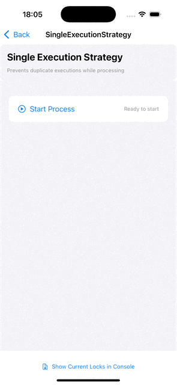
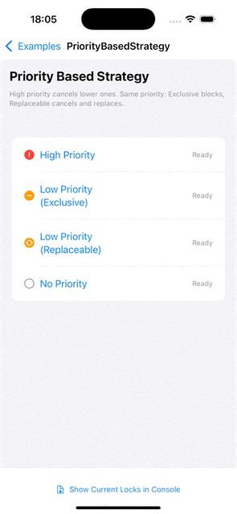
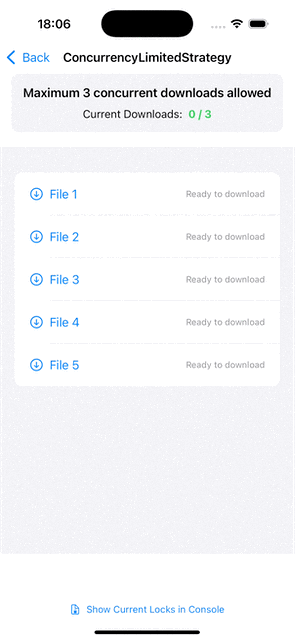

[](https://github.com/takeshishimada/Lockman/actions?query=workflow%3ACI)
[](https://swift.org/download/)
[](https://developer.apple.com/)

[English](../README.md) | [日本語](README_ja.md) | [简体中文](README_zh-CN.md) | [繁體中文](README_zh-TW.md) | [Español](README_es.md) | [Français](README_fr.md) | [Deutsch](README_de.md) | [한국어](README_ko.md) | [Português](README_pt-BR.md) | [Italiano](README_it.md)

Lockman은 The Composable Architecture (TCA) 애플리케이션에서 동시 액션 제어 문제를 해결하는 Swift 라이브러리로, 반응성, 투명성, 선언적 설계에 중점을 둡니다.

* [설계 철학](#설계-철학)
* [개요](#개요)
* [기본 예제](#기본-예제)
* [설치](#설치)
* [커뮤니티](#커뮤니티)

## 설계 철학

### Designing Fluid Interfaces 원칙

WWDC18의 "Designing Fluid Interfaces" 프레젠테이션은 뛰어난 인터페이스를 위한 원칙을 제시했습니다:

* **즉각적인 응답과 지속적인 리디렉션** - 10ms의 지연도 허용하지 않는 반응성
* **터치와 콘텐츠 간의 일대일 움직임** - 드래그 작업 중 콘텐츠가 손가락을 따라감
* **지속적인 피드백** - 모든 상호작용에 대한 즉각적인 반응
* **병렬 제스처 감지** - 여러 제스처를 동시에 인식
* **공간적 일관성** - 애니메이션 중 위치 일관성 유지
* **가벼운 상호작용, 증폭된 출력** - 작은 입력에서 큰 효과

### 기존의 과제

기존 UI 개발은 단순히 동시 버튼 누름과 중복 실행을 금지하여 문제를 해결했습니다. 이러한 접근 방식은 현대적인 유동적 인터페이스 설계에서 사용자 경험을 저해하는 요인이 되었습니다.

사용자는 동시에 버튼을 누르더라도 어떤 형태의 피드백을 기대합니다. UI 레이어에서의 즉각적인 응답과 비즈니스 로직 레이어에서의 적절한 상호 배제 제어를 명확히 분리하는 것이 중요합니다.

## 개요

Lockman은 애플리케이션 개발의 일반적인 문제를 해결하기 위해 다음과 같은 제어 전략을 제공합니다:

* **Single Execution**: 동일한 액션의 중복 실행 방지
* **Priority Based**: 우선순위 기반 액션 제어 및 취소
* **Group Coordination**: 리더/멤버 역할을 통한 그룹 제어
* **Dynamic Condition**: 실행 조건에 기반한 동적 제어
* **Concurrency Limited**: 그룹당 동시 실행 수 제한
* **Composite Strategy**: 여러 전략 조합

## 예제

| Single Execution Strategy | Priority Based Strategy | Concurrency Limited Strategy |
|--------------------------|------------------------|------------------------------|
|  |  |  |

## 코드 예제

`@LockmanSingleExecution` 매크로를 사용하여 프로세스의 중복 실행을 방지하는 기능을 구현하는 방법입니다:

```swift
import ComposableArchitecture
import Lockman

@Reducer
struct ProcessFeature {
    @ObservableState
    struct State: Equatable {
        var isProcessing = false
        var message = ""
    }
    
    enum Action: ViewAction {
        case view(ViewAction)
        case `internal`(InternalAction)
        
        @LockmanSingleExecution
        enum ViewAction {
            case startProcessButtonTapped
            
            var lockmanInfo: LockmanSingleExecutionInfo {
                .init(actionId: actionName, mode: .boundary)
            }
        }
        
        enum InternalAction {
            case processStart
            case processCompleted
        }
    }
    
    enum CancelID {
        case userAction
    }
    
    var body: some Reducer<State, Action> {
        Reduce { state, action in
            switch action {
            case let .view(viewAction):
                switch viewAction {
                case .startProcessButtonTapped:
                    return .withLock(
                        operation: { send in
                            await send(.internal(.processStart))
                            // Simulate heavy processing
                            try await Task.sleep(nanoseconds: 3_000_000_000)
                            await send(.internal(.processCompleted))
                        },
                        lockFailure: { error, send in
                            // When processing is already in progress
                            state.message = "Processing is already in progress"
                        },
                        action: viewAction,
                        cancelID: CancelID.userAction
                    )
                }
                
            case let .internal(internalAction):
                switch internalAction {
                case .processStart:
                    state.isProcessing = true
                    state.message = "Processing started..."
                    return .none
                    
                case .processCompleted:
                    state.isProcessing = false
                    state.message = "Processing completed"
                    return .none
                }
            }
        }
    }
}
```

`withLock` 메서드는 처리가 진행 중일 때 `startProcessButtonTapped`가 실행되지 않도록 보장하여, 사용자가 버튼을 여러 번 눌러도 중복 작업을 방지합니다.

### 디버그 출력 예제

```
✅ [Lockman] canLock succeeded - Strategy: SingleExecution, BoundaryId: process, Info: LockmanSingleExecutionInfo(actionId: 'startProcessButtonTapped', uniqueId: 7BFC785A-3D25-4722-B9BC-A3A63A7F49FC, mode: boundary)
❌ [Lockman] canLock failed - Strategy: SingleExecution, BoundaryId: process, Info: LockmanSingleExecutionInfo(actionId: 'startProcessButtonTapped', uniqueId: 1EBA9632-DE39-43B6-BE75-7C754476CD4E, mode: boundary), Reason: Boundary 'process' already has an active lock
❌ [Lockman] canLock failed - Strategy: SingleExecution, BoundaryId: process, Info: LockmanSingleExecutionInfo(actionId: 'startProcessButtonTapped', uniqueId: 6C5C569F-4534-40D7-98F6-B4F4B0EE1293, mode: boundary), Reason: Boundary 'process' already has an active lock
✅ [Lockman] canLock succeeded - Strategy: SingleExecution, BoundaryId: process, Info: LockmanSingleExecutionInfo(actionId: 'startProcessButtonTapped', uniqueId: C6779CD1-F8FE-46EB-8605-109F7C8DCEA8, mode: boundary)
❌ [Lockman] canLock failed - Strategy: SingleExecution, BoundaryId: process, Info: LockmanSingleExecutionInfo(actionId: 'startProcessButtonTapped', uniqueId: A54E7748-A3DE-451A-BF06-56224A5C94DA, mode: boundary), Reason: Boundary 'process' already has an active lock
❌ [Lockman] canLock failed - Strategy: SingleExecution, BoundaryId: process, Info: LockmanSingleExecutionInfo(actionId: 'startProcessButtonTapped', uniqueId: 7D4D67A7-1A8C-4521-BB16-92E0D551451A, mode: boundary), Reason: Boundary 'process' already has an active lock
✅ [Lockman] canLock succeeded - Strategy: SingleExecution, BoundaryId: process, Info: LockmanSingleExecutionInfo(actionId: 'startProcessButtonTapped', uniqueId: 08CC1862-136F-4643-A796-F63156D8BF56, mode: boundary)
❌ [Lockman] canLock failed - Strategy: SingleExecution, BoundaryId: process, Info: LockmanSingleExecutionInfo(actionId: 'startProcessButtonTapped', uniqueId: DED418D1-4A10-4EF8-A5BC-9E93D04188CA, mode: boundary), Reason: Boundary 'process' already has an active lock

📊 Current Lock State (SingleExecutionStrategy):
┌─────────────────┬──────────────────┬──────────────────────────────────────┬─────────────────┐
│ Strategy        │ BoundaryId       │ ActionId/UniqueId                    │ Additional Info │
├─────────────────┼──────────────────┼──────────────────────────────────────┼─────────────────┤
│ SingleExecution │ CancelID.process │ startProcessButtonTapped             │ mode: boundary  │
│                 │                  │ 08CC1862-136F-4643-A796-F63156D8BF56 │                 │
└─────────────────┴──────────────────┴──────────────────────────────────────┴─────────────────┘
```

## 문서

출시된 버전과 `main`에 대한 문서는 여기에서 사용할 수 있습니다:

* [`main`](https://takeshishimada.github.io/Lockman/main/documentation/lockman/)
* [0.13.0](https://takeshishimada.github.io/Lockman/0.13.0/documentation/lockman/)

<details>
<summary>다른 버전</summary>

* [0.12.0](https://takeshishimada.github.io/Lockman/0.12.0/documentation/lockman/)
* [0.11.0](https://takeshishimada.github.io/Lockman/0.11.0/documentation/lockman/)
* [0.10.0](https://takeshishimada.github.io/Lockman/0.10.0/documentation/lockman/)
* [0.9.0](https://takeshishimada.github.io/Lockman/0.9.0/documentation/lockman/)
* [0.8.0](https://takeshishimada.github.io/Lockman/0.8.0/documentation/lockman/)
* [0.7.0](https://takeshishimada.github.io/Lockman/0.7.0/documentation/lockman/)
* [0.6.0](https://takeshishimada.github.io/Lockman/0.6.0/documentation/lockman/)
* [0.5.0](https://takeshishimada.github.io/Lockman/0.5.0/documentation/lockman/)
* [0.4.0](https://takeshishimada.github.io/Lockman/0.4.0/documentation/lockman/)
* [0.3.0](https://takeshishimada.github.io/Lockman/0.3.0/documentation/lockman/)

</details>

라이브러리에 익숙해지는 데 도움이 될 수 있는 여러 문서가 있습니다:

### 필수 사항
* [시작하기](https://takeshishimada.github.io/Lockman/main/documentation/lockman/gettingstarted) - TCA 애플리케이션에 Lockman을 통합하는 방법 알아보기
* [Boundary 개요](https://takeshishimada.github.io/Lockman/main/documentation/lockman/boundaryoverview) - Lockman의 boundary 개념 이해하기
* [잠금](https://takeshishimada.github.io/Lockman/main/documentation/lockman/lock) - 잠금 메커니즘 이해하기
* [잠금 해제](https://takeshishimada.github.io/Lockman/main/documentation/lockman/unlock) - 잠금 해제 메커니즘 이해하기
* [전략 선택](https://takeshishimada.github.io/Lockman/main/documentation/lockman/choosingstrategy) - 사용 사례에 맞는 전략 선택하기
* [구성](https://takeshishimada.github.io/Lockman/main/documentation/lockman/configuration) - 애플리케이션 요구 사항에 맞게 Lockman 구성하기
* [오류 처리](https://takeshishimada.github.io/Lockman/main/documentation/lockman/errorhandling) - 일반적인 오류 처리 패턴 알아보기
* [디버깅 가이드](https://takeshishimada.github.io/Lockman/main/documentation/lockman/debuggingguide) - 애플리케이션에서 Lockman 관련 문제 디버깅하기

### 전략
* [Single Execution Strategy](https://takeshishimada.github.io/Lockman/main/documentation/lockman/singleexecutionstrategy) - 중복 실행 방지
* [Priority Based Strategy](https://takeshishimada.github.io/Lockman/main/documentation/lockman/prioritybasedstrategy) - 우선순위 기반 제어
* [Concurrency Limited Strategy](https://takeshishimada.github.io/Lockman/main/documentation/lockman/concurrencylimitedstrategy) - 동시 실행 제한
* [Group Coordination Strategy](https://takeshishimada.github.io/Lockman/main/documentation/lockman/groupcoordinationstrategy) - 관련 액션 조정
* [Dynamic Condition Strategy](https://takeshishimada.github.io/Lockman/main/documentation/lockman/dynamicconditionstrategy) - 동적 런타임 제어
* [Composite Strategy](https://takeshishimada.github.io/Lockman/main/documentation/lockman/compositestrategy) - 여러 전략 결합

참고: 문서는 영어로만 제공됩니다.

## 설치

Lockman은 [Swift Package Manager](https://swift.org/package-manager/)를 사용하여 설치할 수 있습니다.

### Xcode

Xcode에서 File → Add Package Dependencies를 선택하고 다음 URL을 입력하세요:

```
https://github.com/takeshishimada/Lockman
```

### Package.swift

Package.swift 파일에 종속성을 추가하세요:

```swift
dependencies: [
  .package(url: "https://github.com/takeshishimada/Lockman", from: "0.13.2")
]
```

타겟에 종속성을 추가하세요:

```swift
.target(
  name: "MyApp",
  dependencies: [
    .product(name: "Lockman", package: "Lockman"),
  ]
)
```

### 요구 사항

| 플랫폼  | 최소 버전 |
|---------|-----------|
| iOS     | 13.0      |
| macOS   | 10.15     |
| tvOS    | 13.0      |
| watchOS | 6.0       |

### 버전 호환성

| Lockman | The Composable Architecture |
|---------|----------------------------|
| 0.13.2  | 1.20.2                     |
| 0.13.1  | 1.20.2                     |
| 0.13.0  | 1.20.2                     |
| 0.12.0  | 1.20.1                     |
| 0.11.0  | 1.19.1                     |
| 0.10.0  | 1.19.0                     |
| 0.9.0   | 1.18.0                     |
| 0.8.0   | 1.17.1                     |

<details>
<summary>다른 버전</summary>

| Lockman | The Composable Architecture |
|---------|----------------------------|
| 0.7.0   | 1.17.1                     |
| 0.6.0   | 1.17.1                     |
| 0.5.0   | 1.17.1                     |
| 0.4.0   | 1.17.1                     |
| 0.3.0   | 1.17.1                     |
| 0.2.1   | 1.17.1                     |
| 0.2.0   | 1.17.1                     |
| 0.1.0   | 1.17.1                     |

</details>

## 커뮤니티

### 토론 및 도움말

질문과 토론은 [GitHub Discussions](https://github.com/takeshishimada/Lockman/discussions)에서 진행할 수 있습니다.

### 버그 보고

버그를 발견하면 [Issues](https://github.com/takeshishimada/Lockman/issues)에 보고해 주세요.

### 기여

라이브러리에 기여하고 싶으시면 링크와 함께 PR을 열어주세요!

## 라이선스

이 라이브러리는 MIT 라이선스로 출시되었습니다. 자세한 내용은 [LICENSE](./LICENSE) 파일을 참조하세요.