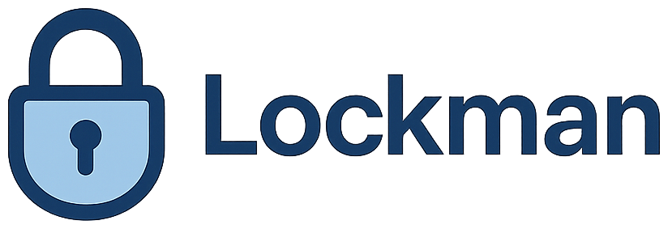

[](https://github.com/takeshishimada/Lockman/actions?query=workflow%3ACI)
[](https://swift.org/download/)
[](https://developer.apple.com/)

Lockman is a Swift library that solves concurrent action control issues in The Composable Architecture (TCA) applications, with responsiveness, transparency, and declarative design in mind.

* [Design Philosophy](#design-philosophy)
* [Overview](#overview)
* [Basic Example](#basic-example)
* [Installation](#installation)
* [Community](#community)

## Design Philosophy

### Principles from Designing Fluid Interfaces

WWDC18's "Designing Fluid Interfaces" presented principles for exceptional interfaces:

* **Immediate Response and Continuous Redirection** - Responsiveness that doesn't allow even 10ms of delay
* **One-to-One Touch and Content Movement** - Content follows the finger during drag operations
* **Continuous Feedback** - Immediate reaction to all interactions
* **Parallel Gesture Detection** - Recognizing multiple gestures simultaneously
* **Spatial Consistency** - Maintaining position consistency during animations
* **Lightweight Interactions, Amplified Output** - Large effects from small inputs

### Traditional Challenges

Traditional UI development has solved problems by simply prohibiting simultaneous button presses and duplicate executions. These approaches have become factors that hinder user experience in modern fluid interface design.

Users expect some form of feedback even when pressing buttons simultaneously. It's crucial to clearly separate immediate response at the UI layer from appropriate mutual exclusion control at the business logic layer.

## Overview

Lockman provides the following control strategies to address common problems in app development:

* **Single Execution**: Prevents duplicate execution of the same action
* **Priority Based**: Action control and cancellation based on priority
* **Group Coordination**: Group control through leader/member roles
* **Dynamic Condition**: Dynamic control based on runtime conditions
* **Concurrency Limited**: Limits the number of concurrent executions per group
* **Composite Strategy**: Combination of multiple strategies

## Basic Example

Example of single-execution action control:


```
✅ [Lockman] canLock succeeded - Strategy: SingleExecution, BoundaryId: process, Info: LockmanSingleExecutionInfo(actionId: 'startProcessButtonTapped', uniqueId: 7BFC785A-3D25-4722-B9BC-A3A63A7F49FC, mode: boundary)
❌ [Lockman] canLock failed - Strategy: SingleExecution, BoundaryId: process, Info: LockmanSingleExecutionInfo(actionId: 'startProcessButtonTapped', uniqueId: 1EBA9632-DE39-43B6-BE75-7C754476CD4E, mode: boundary), Reason: Boundary 'process' already has an active lock
❌ [Lockman] canLock failed - Strategy: SingleExecution, BoundaryId: process, Info: LockmanSingleExecutionInfo(actionId: 'startProcessButtonTapped', uniqueId: 6C5C569F-4534-40D7-98F6-B4F4B0EE1293, mode: boundary), Reason: Boundary 'process' already has an active lock
✅ [Lockman] canLock succeeded - Strategy: SingleExecution, BoundaryId: process, Info: LockmanSingleExecutionInfo(actionId: 'startProcessButtonTapped', uniqueId: C6779CD1-F8FE-46EB-8605-109F7C8DCEA8, mode: boundary)
❌ [Lockman] canLock failed - Strategy: SingleExecution, BoundaryId: process, Info: LockmanSingleExecutionInfo(actionId: 'startProcessButtonTapped', uniqueId: A54E7748-A3DE-451A-BF06-56224A5C94DA, mode: boundary), Reason: Boundary 'process' already has an active lock
❌ [Lockman] canLock failed - Strategy: SingleExecution, BoundaryId: process, Info: LockmanSingleExecutionInfo(actionId: 'startProcessButtonTapped', uniqueId: 7D4D67A7-1A8C-4521-BB16-92E0D551451A, mode: boundary), Reason: Boundary 'process' already has an active lock
✅ [Lockman] canLock succeeded - Strategy: SingleExecution, BoundaryId: process, Info: LockmanSingleExecutionInfo(actionId: 'startProcessButtonTapped', uniqueId: 08CC1862-136F-4643-A796-F63156D8BF56, mode: boundary)
❌ [Lockman] canLock failed - Strategy: SingleExecution, BoundaryId: process, Info: LockmanSingleExecutionInfo(actionId: 'startProcessButtonTapped', uniqueId: DED418D1-4A10-4EF8-A5BC-9E93D04188CA, mode: boundary), Reason: Boundary 'process' already has an active lock

📊 Current Lock State (SingleExecutionStrategy):
┌─────────────────┬──────────────────┬──────────────────────────────────────┬─────────────────┐
│ Strategy        │ BoundaryId       │ ActionId/UniqueId                    │ Additional Info │
├─────────────────┼──────────────────┼──────────────────────────────────────┼─────────────────┤
│ SingleExecution │ CancelID.process │ startProcessButtonTapped             │ mode: boundary  │
│                 │                  │ 08CC1862-136F-4643-A796-F63156D8BF56 │                 │
└─────────────────┴──────────────────┴──────────────────────────────────────┴─────────────────┘
```

## Installation

Lockman can be installed using [Swift Package Manager](https://swift.org/package-manager/).

### Xcode

In Xcode, select File → Add Package Dependencies and enter the following URL:

```
https://github.com/takeshishimada/Lockman
```

### Package.swift

Add the dependency to your Package.swift file:

```swift
dependencies: [
  .package(url: "https://github.com/takeshishimada/Lockman", from: "0.3.0")
]
```

Add the dependency to your target:

```swift
.target(
  name: "MyApp",
  dependencies: [
    .product(name: "Lockman", package: "Lockman"),
  ]
)
```

### Requirements

| Platform | Minimum Version |
|----------|----------------|
| iOS      | 13.0           |
| macOS    | 10.15          |
| tvOS     | 13.0           |
| watchOS  | 6.0            |

### Version Compatibility

| Lockman | The Composable Architecture |
|---------|----------------------------|
| 0.3.0   | 1.17.1                     |
| 0.2.1   | 1.17.1                     |
| 0.2.0   | 1.17.1                     |
| 0.1.0   | 1.17.1                     |

## Community

### Discussion and Help

Questions and discussions can be held on [GitHub Discussions](https://github.com/takeshishimada/Lockman/discussions).

### Bug Reports

If you find a bug, please report it on [Issues](https://github.com/takeshishimada/Lockman/issues).

### Contributing

If you'd like to contribute to the library, please open a PR with a link to it!

## License

This library is released under the MIT License. See the [LICENSE](./LICENSE) file for details.
