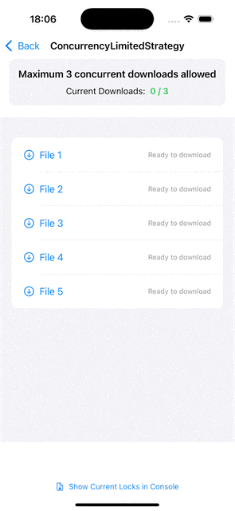

[](https://github.com/takeshishimada/Lockman/actions?query=workflow%3ACI)
[](https://swift.org/download/)
[](https://developer.apple.com/)


Lockman 是一個 Swift 函式庫，旨在解決 The Composable Architecture (TCA) 應用程式中的並行動作控制問題，著重於回應性、透明性和宣告式設計。

* [設計理念](#設計理念)
* [概述](#概述)
* [基本範例](#基本範例)
* [安裝](#安裝)
* [社群](#社群)

## 設計理念

### Designing Fluid Interfaces 原則

WWDC18 的「Designing Fluid Interfaces」提出了卓越介面的原則：

* **即時回應和持續重新導向** - 不允許有 10 毫秒延遲的回應性
* **一對一的觸控和內容移動** - 拖曳操作時內容跟隨手指
* **持續回饋** - 對所有互動的即時反應
* **平行手勢偵測** - 同時識別多個手勢
* **空間一致性** - 動畫期間保持位置一致性
* **輕量級互動，放大輸出** - 小輸入產生大效果

### 傳統挑戰

傳統 UI 開發透過簡單地禁止同時按下按鈕和重複執行來解決問題。這些方法已成為現代流暢介面設計中阻礙使用者體驗的因素。

使用者期望即使同時按下按鈕也能獲得某種形式的回饋。在 UI 層的即時回應與業務邏輯層的適當互斥控制之間進行清晰分離至關重要。

## 概述

Lockman 提供以下控制策略來解決應用程式開發中的常見問題：

* **Single Execution**：防止相同動作的重複執行
* **Priority Based**：基於優先順序的動作控制和取消
* **Group Coordination**：透過領導者/成員角色進行群組控制
* **Dynamic Condition**：基於執行時條件的動態控制
* **Concurrency Limited**：限制每組的並行執行數量
* **Composite Strategy**：多種策略的組合

## 範例

| Single Execution Strategy | Priority Based Strategy | Concurrency Limited Strategy |
|--------------------------|------------------------|------------------------------|
|  |  |  |

## 程式碼範例

以下是如何使用 `@LockmanSingleExecution` 巨集實作防止程序重複執行的功能：

```swift
import CasePaths
import ComposableArchitecture
import Lockman

@Reducer
struct ProcessFeature {
    @ObservableState
    struct State: Equatable {
        var isProcessing = false
        var message = ""
    }
    
    @CasePathable
    enum Action: ViewAction {
        case view(ViewAction)
        case `internal`(InternalAction)
        
        @LockmanSingleExecution
        enum ViewAction {
            case startProcessButtonTapped
            
            var lockmanInfo: LockmanSingleExecutionInfo {
                .init(actionId: actionName, mode: .boundary)
            }
        }
        
        enum InternalAction {
            case processStart
            case processCompleted
            case updateMessage(String)
        }
    }
    
    enum CancelID {
        case userAction
    }
    
    var body: some Reducer<State, Action> {
        Reduce { state, action in
            switch action {
            case let .view(viewAction):
                switch viewAction {
                case .startProcessButtonTapped:
                    return .run { send in
                        await send(.internal(.processStart))
                        // 模擬重處理
                        try await Task.sleep(nanoseconds: 3_000_000_000)
                        await send(.internal(.processCompleted))
                    }
                }
                
            case let .internal(internalAction):
                switch internalAction {
                case .processStart:
                    state.isProcessing = true
                    state.message = "處理已開始..."
                    return .none
                    
                case .processCompleted:
                    state.isProcessing = false
                    state.message = "處理已完成"
                    return .none
                    
                case .updateMessage(let message):
                    state.message = message
                    return .none
                }
            }
        }
        .lock(
            boundaryId: CancelID.userAction,
            lockFailure: { error, send in
                // 當處理已經在進行中時
                if error is LockmanSingleExecutionError {
                    // 透過動作更新訊息而不是直接修改狀態
                    await send(.internal(.updateMessage("處理已經在進行中")))
                }
            },
            for: \.view
        )
    }
}
```

`Reducer.lock` 修飾符自動對符合 `LockmanAction` 的動作應用鎖管理。由於 `ViewAction` 枚舉被標記為 `@LockmanSingleExecution`，`startProcessButtonTapped` 動作在處理進行中時不會被執行。`for: \.view` 參數告訴 Lockman 檢查嵌套在 `view` 情況中的動作的 `LockmanAction` 一致性。

### 除錯輸出範例

```
✅ [Lockman] canLock succeeded - Strategy: SingleExecution, BoundaryId: process, Info: LockmanSingleExecutionInfo(actionId: 'startProcessButtonTapped', uniqueId: 7BFC785A-3D25-4722-B9BC-A3A63A7F49FC, mode: boundary)
❌ [Lockman] canLock failed - Strategy: SingleExecution, BoundaryId: process, Info: LockmanSingleExecutionInfo(actionId: 'startProcessButtonTapped', uniqueId: 1EBA9632-DE39-43B6-BE75-7C754476CD4E, mode: boundary), Reason: Boundary 'process' already has an active lock
❌ [Lockman] canLock failed - Strategy: SingleExecution, BoundaryId: process, Info: LockmanSingleExecutionInfo(actionId: 'startProcessButtonTapped', uniqueId: 6C5C569F-4534-40D7-98F6-B4F4B0EE1293, mode: boundary), Reason: Boundary 'process' already has an active lock
✅ [Lockman] canLock succeeded - Strategy: SingleExecution, BoundaryId: process, Info: LockmanSingleExecutionInfo(actionId: 'startProcessButtonTapped', uniqueId: C6779CD1-F8FE-46EB-8605-109F7C8DCEA8, mode: boundary)
❌ [Lockman] canLock failed - Strategy: SingleExecution, BoundaryId: process, Info: LockmanSingleExecutionInfo(actionId: 'startProcessButtonTapped', uniqueId: A54E7748-A3DE-451A-BF06-56224A5C94DA, mode: boundary), Reason: Boundary 'process' already has an active lock
❌ [Lockman] canLock failed - Strategy: SingleExecution, BoundaryId: process, Info: LockmanSingleExecutionInfo(actionId: 'startProcessButtonTapped', uniqueId: 7D4D67A7-1A8C-4521-BB16-92E0D551451A, mode: boundary), Reason: Boundary 'process' already has an active lock
✅ [Lockman] canLock succeeded - Strategy: SingleExecution, BoundaryId: process, Info: LockmanSingleExecutionInfo(actionId: 'startProcessButtonTapped', uniqueId: 08CC1862-136F-4643-A796-F63156D8BF56, mode: boundary)
❌ [Lockman] canLock failed - Strategy: SingleExecution, BoundaryId: process, Info: LockmanSingleExecutionInfo(actionId: 'startProcessButtonTapped', uniqueId: DED418D1-4A10-4EF8-A5BC-9E93D04188CA, mode: boundary), Reason: Boundary 'process' already has an active lock

📊 Current Lock State (SingleExecutionStrategy):
┌─────────────────┬──────────────────┬──────────────────────────────────────┬─────────────────┐
│ Strategy        │ BoundaryId       │ ActionId/UniqueId                    │ Additional Info │
├─────────────────┼──────────────────┼──────────────────────────────────────┼─────────────────┤
│ SingleExecution │ CancelID.process │ startProcessButtonTapped             │ mode: boundary  │
│                 │                  │ 08CC1862-136F-4643-A796-F63156D8BF56 │                 │
└─────────────────┴──────────────────┴──────────────────────────────────────┴─────────────────┘
```

## 文件

發布版本和 `main` 分支的文件可在此處取得：

* [`main`](https://takeshishimada.github.io/Lockman/main/documentation/lockman/)
* [1.3.0](https://takeshishimada.github.io/Lockman/1.3.0/documentation/lockman/) ([移轉指南](https://takeshishimada.github.io/Lockman/1.3.0/documentation/lockman/migratingto1.3))
* [1.2.0](https://takeshishimada.github.io/Lockman/1.2.0/documentation/lockman/) ([遷移指南](https://takeshishimada.github.io/Lockman/1.2.0/documentation/lockman/migratingto1.2))
* [1.1.0](https://takeshishimada.github.io/Lockman/1.1.0/documentation/lockman/) ([遷移指南](https://takeshishimada.github.io/Lockman/1.1.0/documentation/lockman/migratingto1.1))

<details>
<summary>其他版本</summary>

* [1.0.0](https://takeshishimada.github.io/Lockman/1.0.0/documentation/lockman/) ([移轉指南](https://takeshishimada.github.io/Lockman/1.0.0/documentation/lockman/migratingto1.0))
* [0.13.0](https://takeshishimada.github.io/Lockman/0.13.0/documentation/lockman/)
* [0.12.0](https://takeshishimada.github.io/Lockman/0.12.0/documentation/lockman/)
* [0.11.0](https://takeshishimada.github.io/Lockman/0.11.0/documentation/lockman/)
* [0.10.0](https://takeshishimada.github.io/Lockman/0.10.0/documentation/lockman/)
* [0.9.0](https://takeshishimada.github.io/Lockman/0.9.0/documentation/lockman/)
* [0.8.0](https://takeshishimada.github.io/Lockman/0.8.0/documentation/lockman/)
* [0.7.0](https://takeshishimada.github.io/Lockman/0.7.0/documentation/lockman/)
* [0.6.0](https://takeshishimada.github.io/Lockman/0.6.0/documentation/lockman/)
* [0.5.0](https://takeshishimada.github.io/Lockman/0.5.0/documentation/lockman/)
* [0.4.0](https://takeshishimada.github.io/Lockman/0.4.0/documentation/lockman/)
* [0.3.0](https://takeshishimada.github.io/Lockman/0.3.0/documentation/lockman/)

</details>

文件中有許多文章可以幫助您更好地使用該函式庫：

### 基礎知識
* [入門指南](https://takeshishimada.github.io/Lockman/main/documentation/lockman/gettingstarted) - 了解如何將 Lockman 整合到您的 TCA 應用程式中
* [邊界概述](https://takeshishimada.github.io/Lockman/main/documentation/lockman/boundaryoverview) - 理解 Lockman 中的邊界概念
* [鎖定](https://takeshishimada.github.io/Lockman/main/documentation/lockman/lock) - 理解鎖定機制
* [解鎖](https://takeshishimada.github.io/Lockman/main/documentation/lockman/unlock) - 理解解鎖機制
* [選擇策略](https://takeshishimada.github.io/Lockman/main/documentation/lockman/choosingstrategy) - 為您的使用案例選擇合適的策略
* [設定](https://takeshishimada.github.io/Lockman/main/documentation/lockman/configuration) - 根據應用程式需求設定 Lockman
* [錯誤處理](https://takeshishimada.github.io/Lockman/main/documentation/lockman/errorhandling) - 了解常見的錯誤處理模式
* [除錯指南](https://takeshishimada.github.io/Lockman/main/documentation/lockman/debuggingguide) - 除錯應用程式中與 Lockman 相關的問題

### 策略
* [Single Execution Strategy](https://takeshishimada.github.io/Lockman/main/documentation/lockman/singleexecutionstrategy) - 防止重複執行
* [Priority Based Strategy](https://takeshishimada.github.io/Lockman/main/documentation/lockman/prioritybasedstrategy) - 基於優先順序的控制
* [Concurrency Limited Strategy](https://takeshishimada.github.io/Lockman/main/documentation/lockman/concurrencylimitedstrategy) - 限制並行執行
* [Group Coordination Strategy](https://takeshishimada.github.io/Lockman/main/documentation/lockman/groupcoordinationstrategy) - 協調相關動作
* [Dynamic Condition Strategy](https://takeshishimada.github.io/Lockman/main/documentation/lockman/dynamicconditionstrategy) - 動態執行時控制
* [Composite Strategy](https://takeshishimada.github.io/Lockman/main/documentation/lockman/compositestrategy) - 組合多種策略

註：文件僅提供英文版本。

## 安裝

Lockman 可以使用 [Swift Package Manager](https://swift.org/package-manager/) 進行安裝。

### Xcode

在 Xcode 中，選擇 File → Add Package Dependencies 並輸入以下 URL：

```
https://github.com/takeshishimada/Lockman
```

### Package.swift

將相依性新增到您的 Package.swift 檔案中：

```swift
dependencies: [
  .package(url: "https://github.com/takeshishimada/Lockman", from: "1.3.0")
]
```

將相依性新增到您的目標中：

```swift
.target(
  name: "MyApp",
  dependencies: [
    .product(name: "Lockman", package: "Lockman"),
  ]
)
```

### 系統需求

| 平台      | 最低版本 |
|----------|---------|
| iOS      | 13.0    |
| macOS    | 10.15   |
| tvOS     | 13.0    |
| watchOS  | 6.0     |

### 版本相容性

| Lockman | The Composable Architecture |
|---------|----------------------------|
| 1.3.0   | 1.20.2                     |

<details>
<summary>其他版本</summary>

| Lockman | The Composable Architecture |
|---------|----------------------------|
| 1.2.0   | 1.20.2                     |
| 1.1.0   | 1.20.2                     |
| 1.0.0   | 1.20.2                     |
| 0.13.4  | 1.20.2                     |
| 0.13.3  | 1.20.2                     |
| 0.13.2  | 1.20.2                     |
| 0.13.1  | 1.20.2                     |
| 0.13.0  | 1.20.2                     |
| 0.12.0  | 1.20.1                     |
| 0.11.0  | 1.19.1                     |
| 0.10.0  | 1.19.0                     |
| 0.9.0   | 1.18.0                     |
| 0.8.0   | 1.17.1                     |
| 0.7.0   | 1.17.1                     |
| 0.6.0   | 1.17.1                     |
| 0.5.0   | 1.17.1                     |
| 0.4.0   | 1.17.1                     |
| 0.3.0   | 1.17.1                     |
| 0.2.1   | 1.17.1                     |
| 0.2.0   | 1.17.1                     |
| 0.1.0   | 1.17.1                     |

</details>

## Translations

This documentation is also available in other languages:

- [English](../README.md)
- [日本語 (Japanese)](README_ja.md)
- [简体中文 (Simplified Chinese)](README_zh-CN.md)
- [繁體中文 (Traditional Chinese)](README_zh-TW.md)
- [Español (Spanish)](README_es.md)
- [Français (French)](README_fr.md)
- [Deutsch (German)](README_de.md)
- [한국어 (Korean)](README_ko.md)
- [Português (Portuguese)](README_pt-BR.md)
- [Italiano (Italian)](README_it.md)

## 社群

### 討論和協助

可以在 [GitHub Discussions](https://github.com/takeshishimada/Lockman/discussions) 上進行問題討論。

### 錯誤回報

如果發現錯誤，請在 [Issues](https://github.com/takeshishimada/Lockman/issues) 上回報。

### 貢獻

如果您想為該函式庫做出貢獻，請建立一個 PR 並附上相關連結！

## 授權條款

本函式庫基於 MIT 授權條款發布。詳情請參閱 [LICENSE](./LICENSE) 檔案。